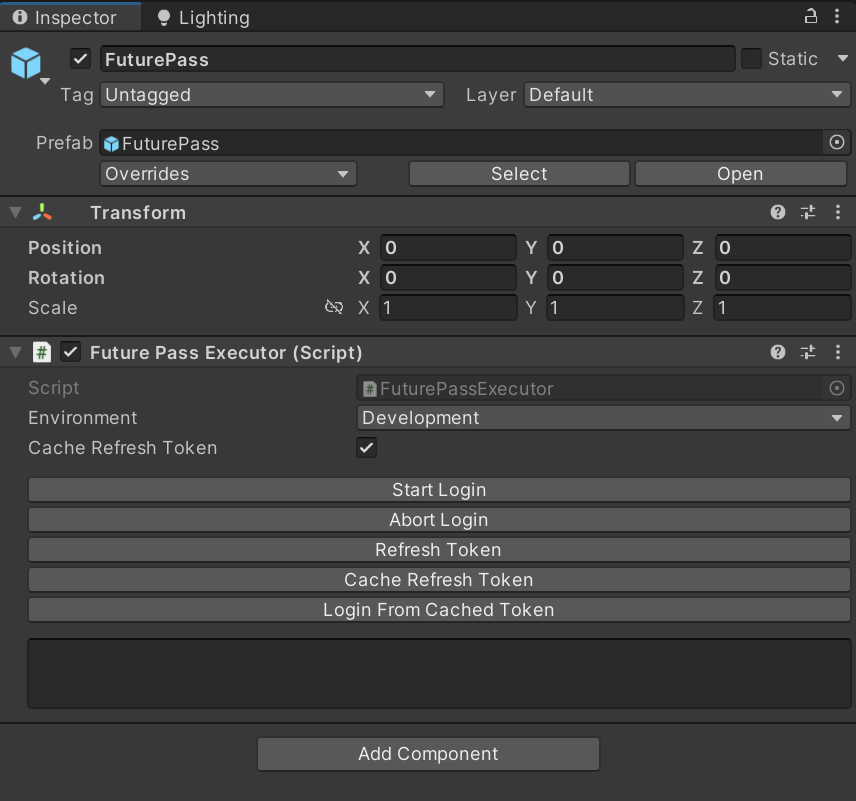

# sdk-unity-futurepass

This Unity SDK serves as an easy point of access to the FuturePass authentication system. 
It focuses primarily on a custodial authentication flow where the app passes control to a browser, waits for login completion before handling and caching the resultant authentication packet. 

<h2>Getting Started: Using the Debug Functions</h2>

Find and add the "FuturePass" prefab within the package files, or add your own FuturePassAuthenticationManager component into your scene.
  
The component has debug buttons in the inspector to test the various functions the component provides. 
To begin, press the "Start Login" button. This will open your default browser with the FuturePass authentication page. Follow the steps to login through these pages. 
  
Once login is complete, your browser will redirect to a http://localhost:3000/callback page with text that says "You may now close this webpage!". At this point, you may return to Unity and again inspect your authentication component. 
  
Upon a successful login, the text area below the debug buttons will now contain the details of your authentication. 
If you fail authentication, or want to cancel mid-process, you may use the "Abort Login" button to close the webserver listening for the login callback.
  
Once a token has been provisioned, you may ask for a 'refresh' in order to request a new token without running through the custodial flow again. This uses the 'refresh token' that is a part of your cached authentication packet. You may press the "Refresh Token" button to trigger this process. You will notice after a second that the text area again updates with the new details of your authentication (you may need to mouse over the window to update its contents)
  
The final two buttons "Cache Refresh Token" and "Login From Cached Token" perform functions as they describe. The "Cache Refresh Token" will find the refresh token from your currently loaded authentication. It will then encrypt it, and store it using PlayerPrefs. You may cache up to one token per production environment. 
  
The "Login From Cached Token" will load and decrypt this refresh token, and then perform the same refresh flow as above in order to fetch a new authentication packet. 
  
The refresh token is cached by default whenever you perform a custodial flow, or a refresh flow. You may disable this behaviour by un-ticking the "Cache Refresh Token" boolean.

